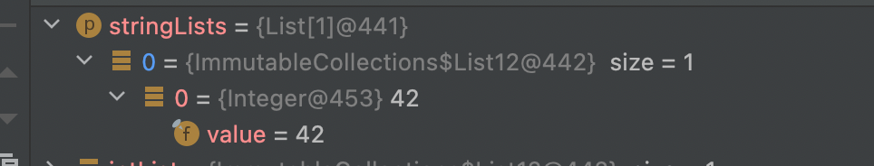

`제네릭 (5장)`

# [ITEM32] 제네릭과 가변인수를 함께 쓸 때는 신중하라

## 1. 가변인수(varargs) 란
___

* jdk 1.5 도입
* 도입된 이유 : 메서드에 넘기는 인수의 개수를 클라이언트가 조절할 수 있게 해준다.
```java
// 기존 이렇게 오버로딩을 진행하던걸
public String sampleMethod(String arg1) {
    // 로직
};

public String sampleMethod(String arg1, String arg2) {
    // 로직
};

// 이렇게 사용할 수 있게 되었다
public String sampleMethod(String... args) {
    // 로직
};
```
* 컴파일시 배열로 처리된다 -> `varargs 매개변수에 제네릭이나 매개변수화 타입이 포함되면 알기 어려운 컴파일 경고가 발생하는 이유`
```java
public String[] variable(String... s) {
    return s;
}
```

## 2. 힙 오염이 발생하는 경우가 가변인수를 써서일까?
> 이 메서드에서는 형변환하는 곳이 보이지 않는데도 인수를 건네 호출하면 ClassCastException 을 던진다. 마지막 줄에 컴파일러가 생성한 (보이지 않는) 형변환이 숨어 있기 때문이다. 
> 이처럼 타입 안전성이 깨지니 제네릭 varargs 배열 매개변수에 값을 저장하는 것은 안전하지 않다.
```java
static void dangerous(List<String>... stringLists) {
    List<Integer> intList = List.of(42);
    Object[] objects = stringLists;
    objects[0] = intList; // 힙오염발생
    String s = stringList[0].get[0]; // ClassCastException
}
```


* 배열 주소값을 주었기 때문. 만약, 가변인수가 아닌 List<String> stringLists 를 파라미터로 갖는 메소드였다면, Object[] objects = stringLists; 여기서 컴파일될 수가 없다.


## 3. 제네릭 배열을 프로그래머가 직접 생성하는건 허용하지 않으면서, 제네릭 varargs 매개변수를 받는 메서드를 선언할 수 있게 한 이유?
```java
List<String>[] stringLists = new List<String>[1]; // 컴파일 불가
```
* 이유 : 제너릭이나 매개변수화 타입의 varargs 매개변수를 받는 메서드가 실무에서 매우 유용하기 때문
* 자바 라이브러리에도 이런 메서드를 여럿 제공한다. 다행히 이 메서드들은 타입에 안전하다.
  * Arrays.asList(T… a)
  * Collections.addAll(Collection<? super T> c)
  * EnumSet.of(E first, E… rest)


## 4. @SafeVarargs
* 메서드 작성자가 그 메서드가 타입 안전함을 보장하는 장치이다. 컴파일러는 이 약속을 받고 그 메서드가 안전하지 않을 수 있다는 경고를 더 이상 하지 않는다.
* 어떻게 타입 안전한지 알수 있나?
  * 다음 조건을 만족하면서 순수하게 인수들을 전달하는 용도로만 사용될 때
    * (1) varargs 매개변수 배열에 아무것도 저장하지 않는다. (=매개변수 배열을 덮어쓰지 않는다)
    * (2) 그 배열(혹은 복제본)을 신뢰할 수 없는 코드에 노출하지 않는다.

> @SafeVarargs 어노테이션은 재정의할 수 없는 메서드에만 달아야 한다. 재정의한 메서드도 안전할지는 보장할 수 없기 때문이다. 
> 자바 8에서 이 어노테이션은 오직 static 메서드와 final 인스턴스에만 붙일 수 있고, 자바 9부터는 private 인스턴스 메서드에도 허용 된다.


## 5. ???? 
코드 32-2 가 실행시 Exception 을 발생시키는 것은 이해가 된다. 
Object[] 는 String[] 의 하위 타입이 아니라서 이 형변환은 실패한다고.
근데 이게 왜 제네릭 varagrs 매개변수 배열에 다른 메서드가 접근하도록 허용하면 안전하지 않다는 예시가 될까???


`정리`
> jdk 1.5 부터 도입된 가변인수는 배열로 컴파일이 된다. 제네릭 varargs 매개변수는
> 그래서 타입 안전하지 않지만 실무에서 매우 유용하기 때문에 허용된다.
> 사용해야한다면 타입 안전한지 확인해서 @SafeVarargs 를 붙이던가, 이를 사용하고 있는 ListOf 를 이용해보자.